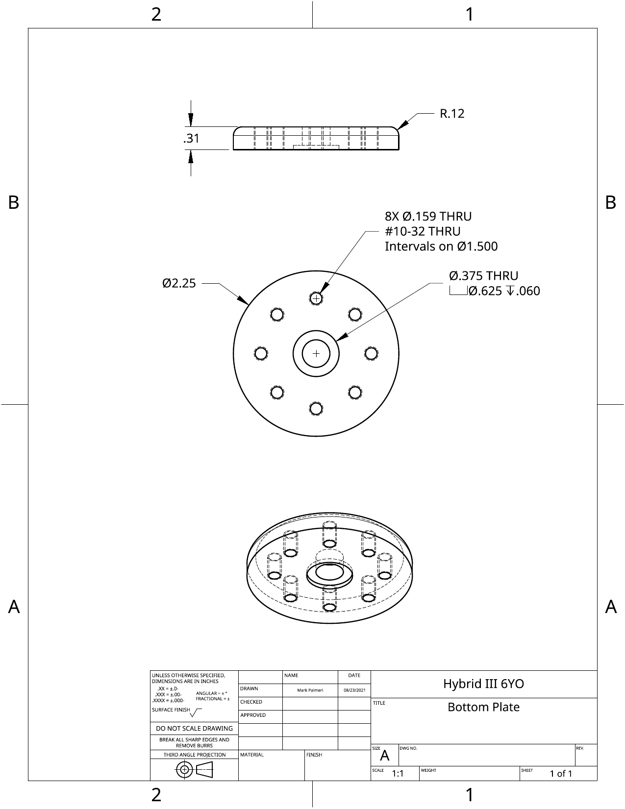
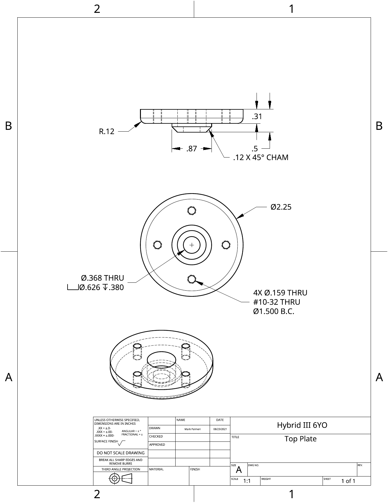
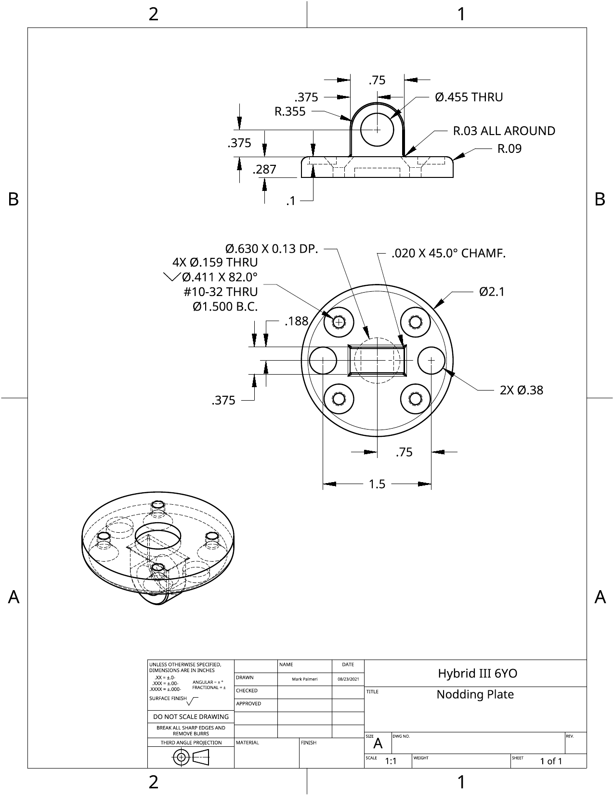
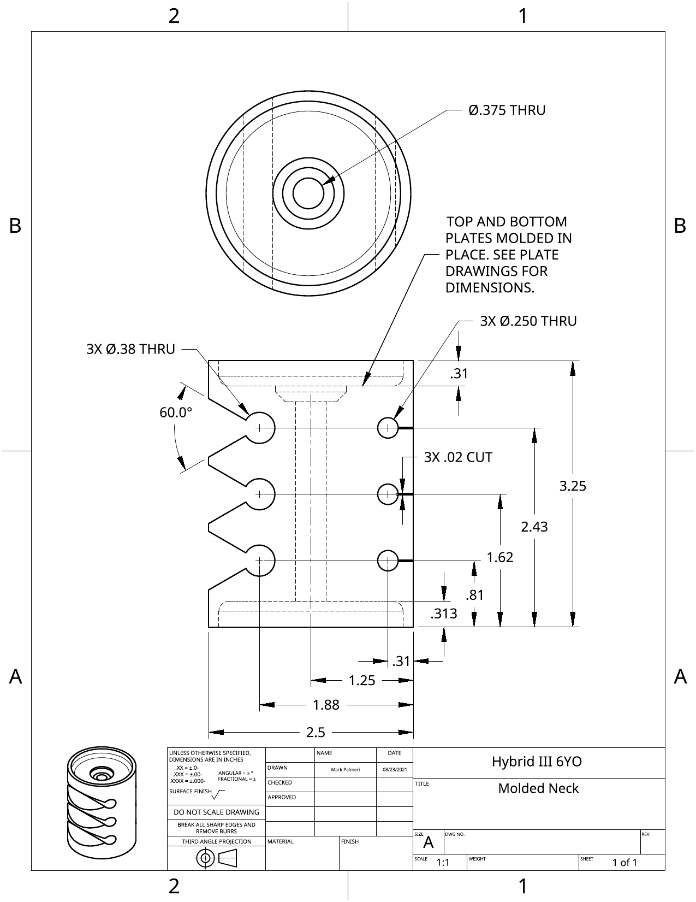
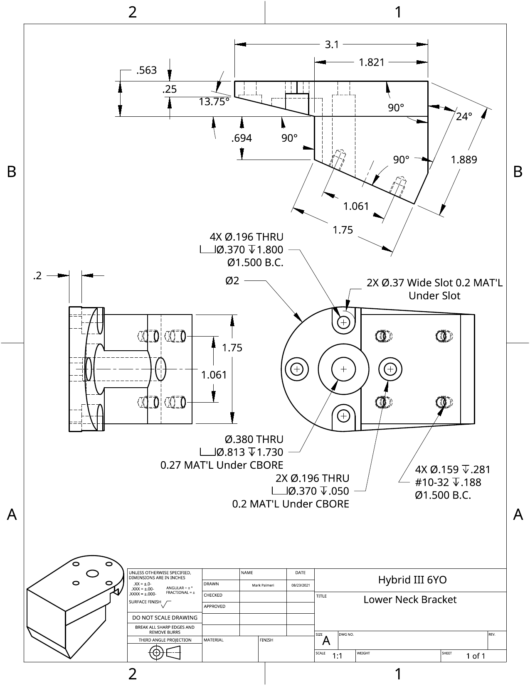
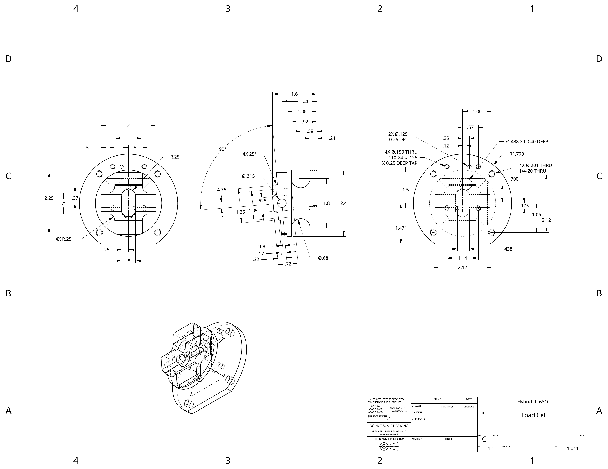
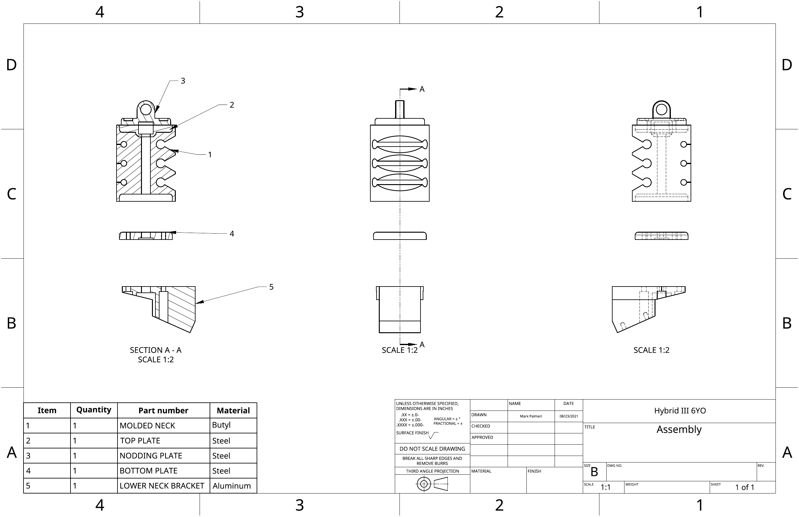

## Tasks

- Create all of the parts for the Hybrid III 6yo test setup based on the
attached drawings. 

- You should create all of these parts and their associated drawings and
assemblies as part of the same “Document” and share that document with Dr.
Palmeri and the TA(s).

- Create the mechanical drawings associated with each of those parts (i.e.,
recreate the drawings that you are using to generate the parts) and the
assembly.

- Assemble your parts as guided by the assembly diagram and as shown in the
uploaded animation. 

- There are online tutorials on Assemblies if you need some refreshers:

  - [https://learn.onshape.com/courses/introduction-to-assembly-design](https://learn.onshape.com/courses/introduction-to-assembly-design)

  - [https://learn.onshape.com/courses/fundamentals-onshape-assemblies](https://learn.onshape.com/courses/fundamentals-onshape-assemblies)

## What to submit

Upload mechanical drawings and a screenshot of the part for all of your parts
to the `Hybrid III 6 y/o` Canvas assignment.

## Bottom Plate

{width="800"}

## Top Plate

{ width="800"}

## Nodding Plate

{ width="800"}

## Molded Neck

{ width="800"}

::: callout-tip
Note that the this part has features that are dependent on the top and bottom plates.  To reduce the overhead of manually entering these dimensions from the other parts, you can use the `Derived` tool in Onshape to bring in the relevant faces from the other parts.

[https://cad.onshape.com/help/Content/derived.htm#StepsDesktop](https://cad.onshape.com/help/Content/derived.htm#StepsDesktop)
:::

## Lower Neck Bracket

{ width="800"}

## Load Cell

{ width="800"}

## Assembly

{ width="800"}
