# Electronics Design Automation: PCB Layout

## PCB Layout

### Why a PCB?

- Breadboards are good for simple testing, but not robust.

- Need to reduce form factor.

- Reduce noise, capacitive effects, etc.

- SMD (versus thru-hole) components are becoming ubiquitous.

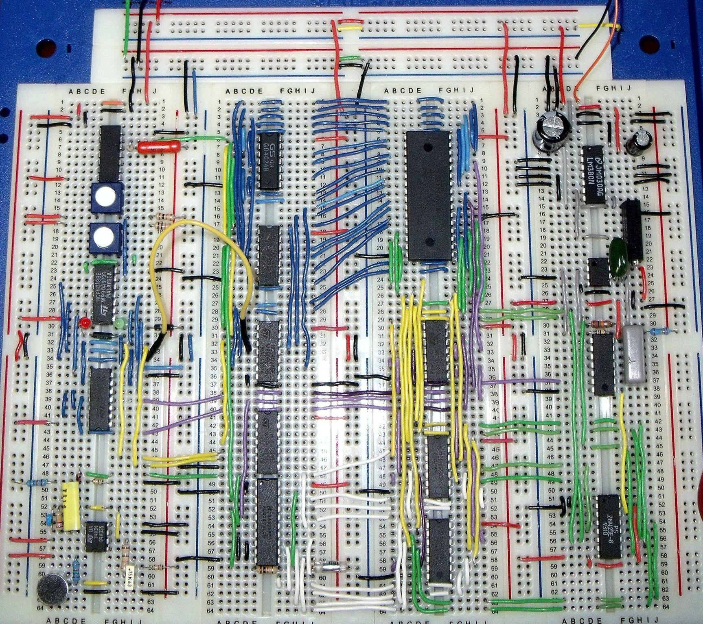{width=400}

### PCB Examples

#### Physical Rendering

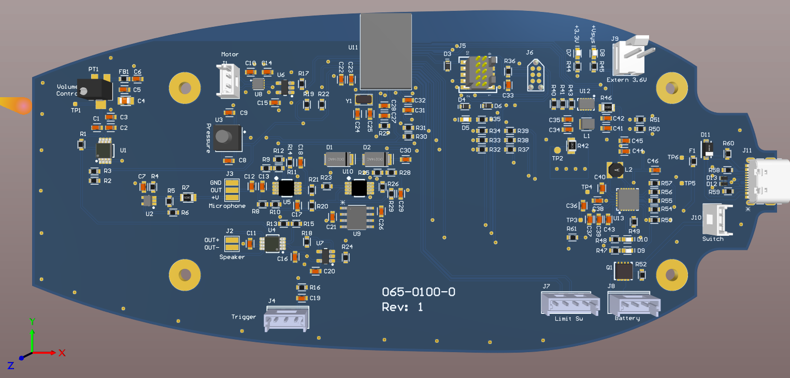{width=800}

### Top Layer

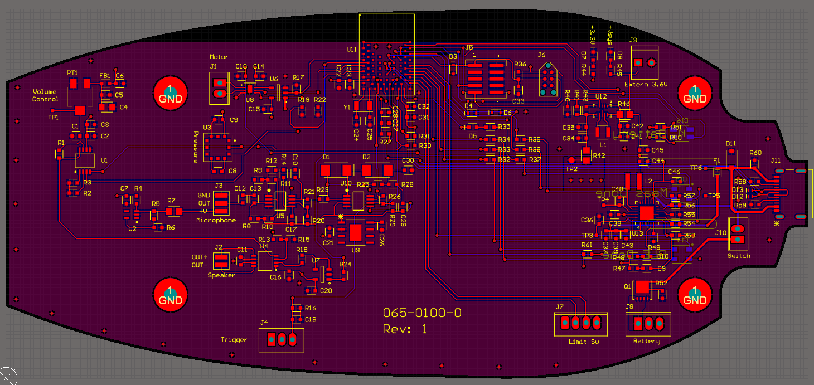{width=800}
### Bottom Layer

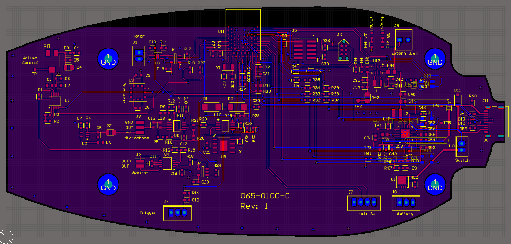{width=800}

### This is actually a four-layer PCB...

There are actually two layers in the middle of the board that are not visible in
the above images:

- **Power Layer**: 3.3 V (`VDD`)

- **GND Layer**

### Two-layer PCB

- Single-layer boards for "trivial" layouts.

- Two-layer board best balance of flexibility and complexity for "simple" layouts.

- $>$ 2 layers increases complexity (but putting power and ground on their own
layers can be advantageous)

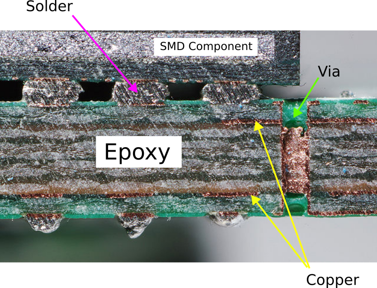{width=400}

### Surface Mount Devices (SMD)

- Surface mount components on the same side as the traces

- Soldering using reflow.

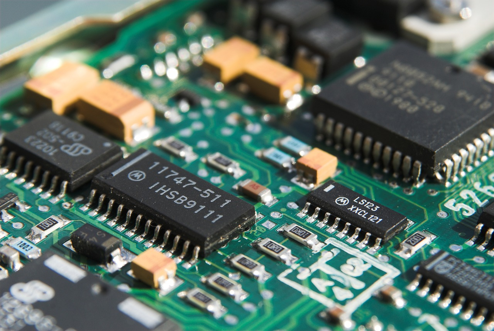{width=400}

## Through-hole Components (THT)

- Thru-hole components on the opposite side from the traces (ease of soldering).

- Can be used on breadboards and protoboards too.

- Way less popular than SMD for production boards.

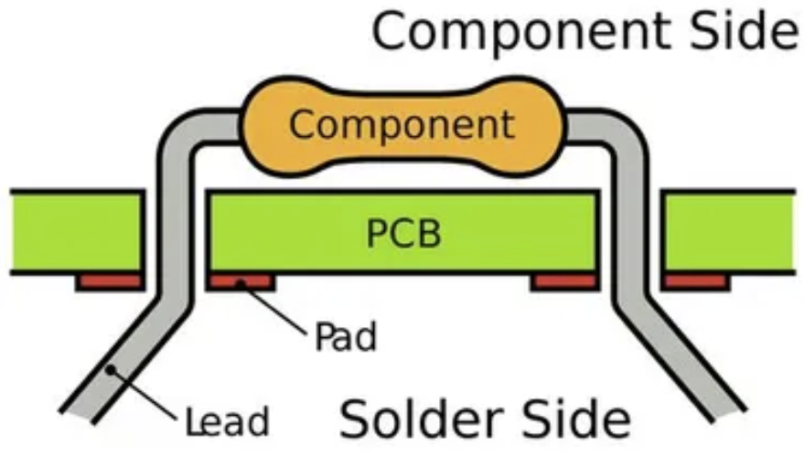{width=400}

### PCB Editor

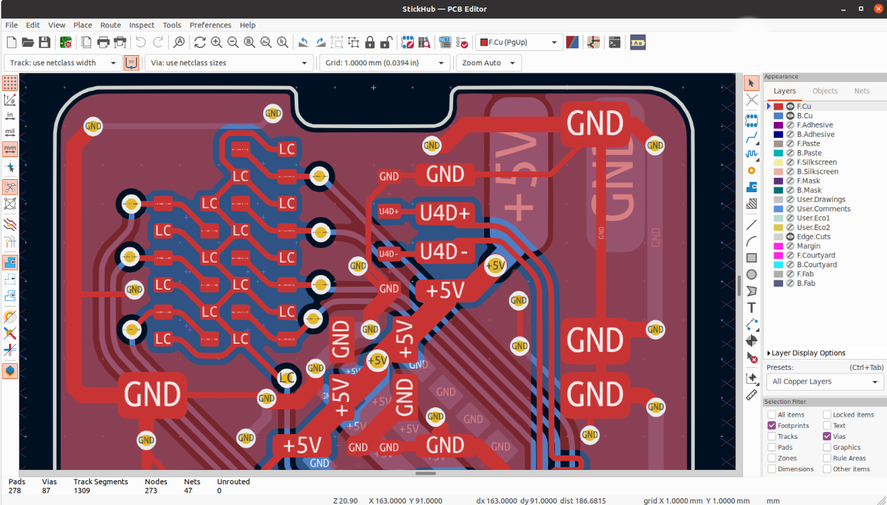{width=800}

### PCB Layout

#### Getting Started

- Make sure that all parts are **annotated** and have **footprints** in the
schematic.

- If needed, include **Mounting Holes** in your design.

- Switch to the PCB editor (`Tools` $\rightarrow$ `Update PCB from Schematic`).

- All component pins/pads that need to be connected with traces will be
connected with airwires.

#### Creating the PCB Edge Outline

- Use **Graphics Lines** tool to create board outline (Layer: `Edge.Cuts`)

- Layout components based on your design needs / constraints, considering
orientation, board side, etc.

- You can import a picture / CAD drawing to base the Edge outline on.

#### Design Rules

- Each board manufacturer has different capabilities and constraints on PCB fabrication.

- For our mil, setup **Design Rules** (`File` $\rightarrow$ `Board Setup...`) as follows:

  - Trace width ($\geq$ 20 mil)

  - Drill diameter ($\geq$ 1 mm)

  - Clearance ($\geq$ 32 mil)

- This can be done automatically by importing a design rules (DRU) file.  I will
be providing a `*.kicad_dru` file for you to use in your labs and project.

---

#### Routing Traces (Tracks)

- Setup **Net Classes** for signal and power/ground (wider / more clearance).

- Choose the layer that you want your traces to be on (Front (`F.Cu`) or Back (`B.Cu`)).

- Route traces to make connections indicated by the airwires.

  - Remember that you can go around and under parts.

  - Avoid right angles (mitigate EMI).

- You do not need to connect `GND` with traces, as you will be creating a copper
pour for that.

- Use `Filled Zone` tool to create a copper pour (`F/B.Cu`), usually associated
with the `GND` net.

- Clearout other zones, as needed (e.g., plug, wireless controller).

- Perform **Design Rule Check (DRC)**

#### Power Traces / Layers

- Larger trace width for greater power delivery (less resistance for more current).

- Even better to dedicate an entire layer

  - More direct return paths

  - Shielding (EMI)

  - Reduce noise (switching)

  - Dissipate heat

---

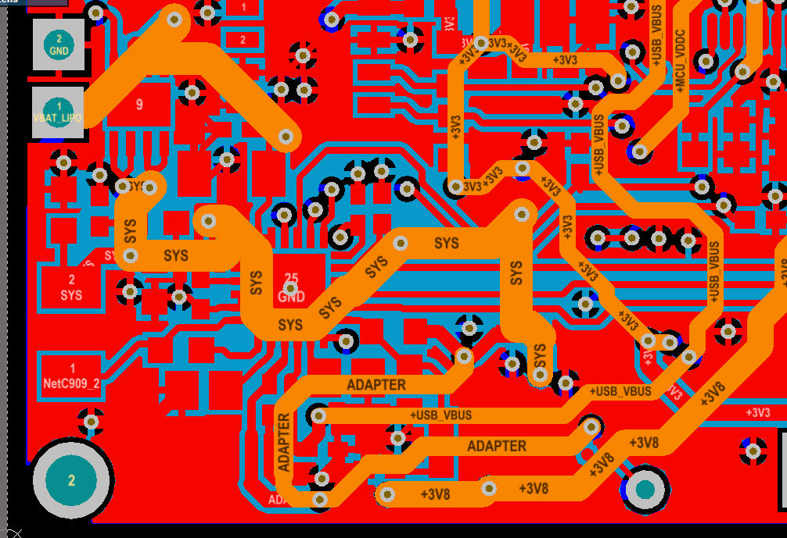{width=500}

#### Copper Ground Pours (Filled Zones)

- Help reject noise \& interference

- Lower impedance to ground

- Save milling time and bits!!

#### Filled Zone Islands

- Avoid creating "islands" of copper pour not connected to the main pour.

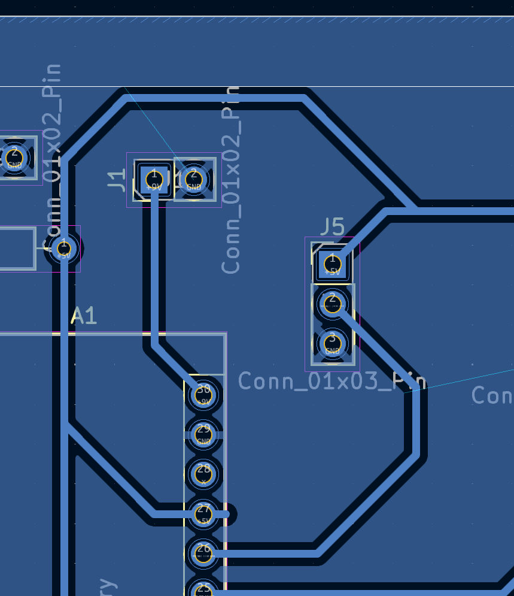{width=175}

- Ways to fix:

  - Rearrange components to allow the filled zone to be contiguous.

  - When using an IC with multiple functional pins, try changing utilized pins.

  - Use a **Via** on a two-sided board.

  - Use a 0 $\Omega$ R to connect the island to the main pour.  The resistor acts as a wire bridge to jump over other traces.

#### Reducing Noise

- Separate analog (`AGND`) and digital grounds (`GND`), and electrically connect using a **Net Tie**.

- Reduce trace "loops" (RF interference)

- Place decoupling capacitors next to power pins they are supporting.

#### Ground Connections

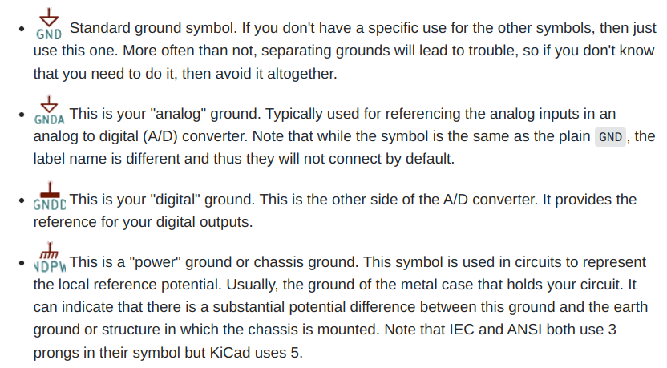{width=800}

---

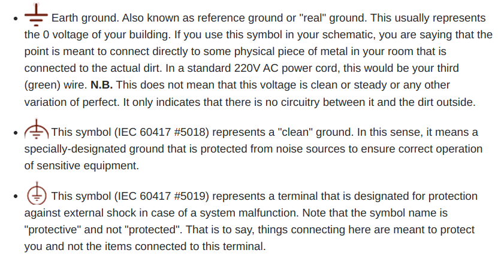{width=800}

[https://electronics.stackexchange.com/questions/392911/kicad-5-what-is-the-significance-of-the-various-gnd-symbols](https://electronics.stackexchange.com/questions/392911/kicad-5-what-is-the-significance-of-the-various-gnd-symbols)

### Tips-n-Tricks

- You need to make sure that you update your PCB everytime you edit your
schematic.  Failing to do so will create asyncrony of the two documents, which
will be **painful** to resolve.

- Clean up airwires with the `Ratsnest` tool.

- **Vias**: connections between top and bottom layers of a board.  These can be
plated or connected with a physical wire.

- Use plugs/sockets for off-board wire connections.

- Strategically place test pins / pads.

- Parallel running connections (e.g., `PWR` & `GND`) can be routed as a
**Differential Pair**.

### Thermal Relief

- Thermal relief is a technique used to make soldering easier by reducing the
amount of copper connected to a pad, especially useful for large copper pours.

- The thermal relief pattern reduce thermal conductivity away from the pad,
making it easier to solder.

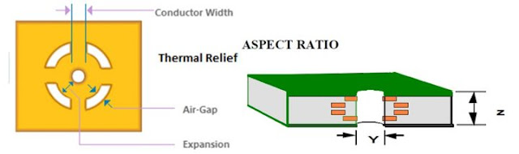{width=800}

### 3D View and STEP Export

- You can render a 3D view of your PCB with your components, as long as 3D
models are associated with the components.

- You can export a STEP file for mechanical design that can be importent into
your CAD software for integration with other components.

## Resources

- [KiCad Documentation](https://docs.kicad.org/8.0/en/getting_started_in_kicad/getting_started_in_kicad.html)

- [PCB Basics (SparkFun)](https://learn.sparkfun.com/tutorials/pcb-basics)

- [KiCad Docs: PCB Editor](https://docs.kicad.org/7.0/en/pcbnew/pcbnew.html)

- [Example KiCad Project](https://gitlab.oit.duke.edu/MedTechPrototypingSkills/kicad_test)

- [Grounding and Voltage Routing Considerations in PCB Design](https://resources.pcb.cadence.com/blog/2020-grounding-and-voltage-routing-considerations-in-pcb-design-e2ek)

- [Effective PCB Trace Width and Spacing](https://resources.pcb.cadence.com/blog/2021-effective-pcb-trace-width-and-spacing)

- [PCB Layout Review Checklist](https://github.com/azonenberg/pcb-checklist/blob/master/layout-checklist.md)
