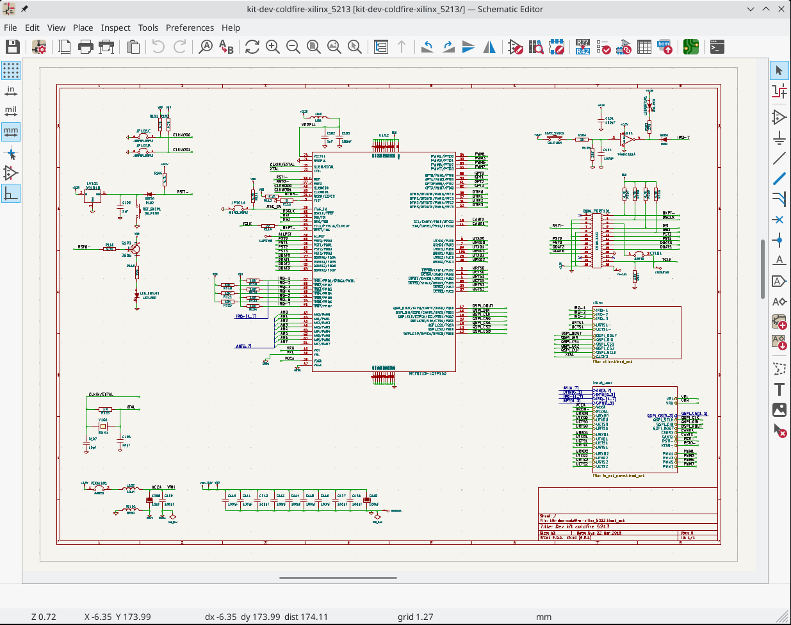
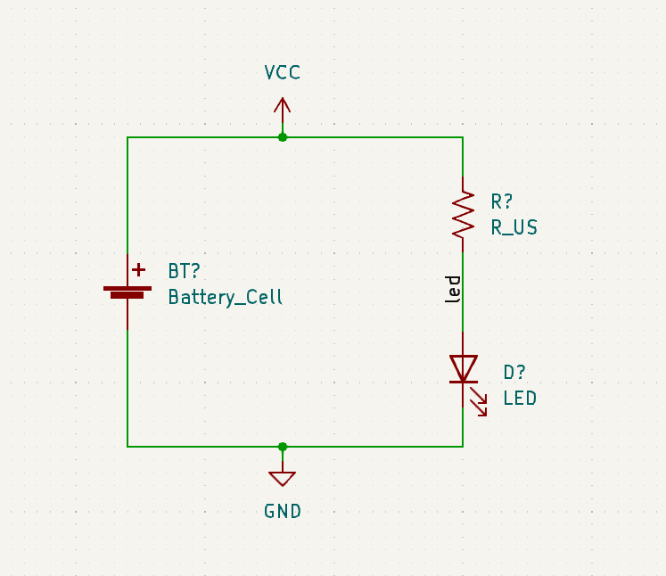
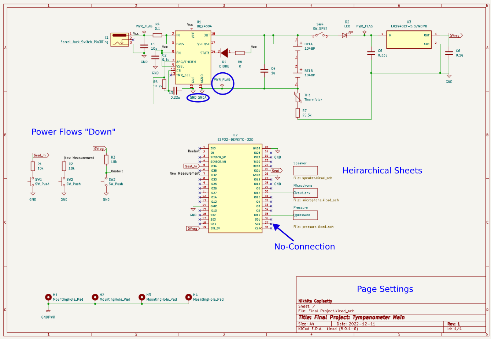
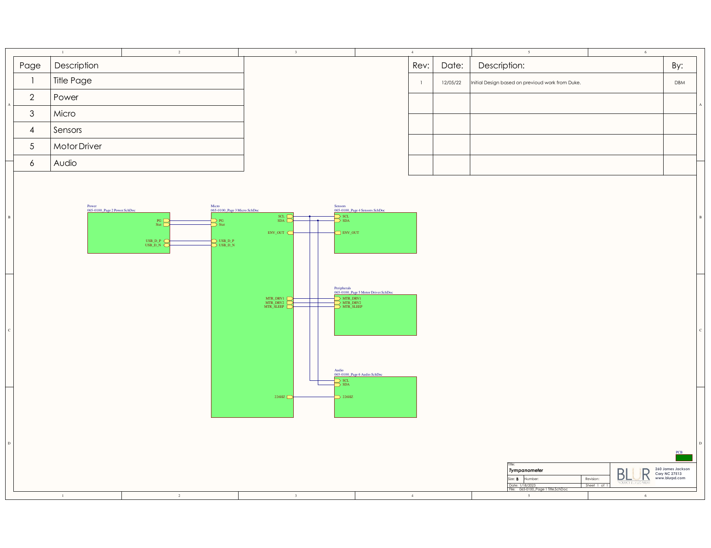
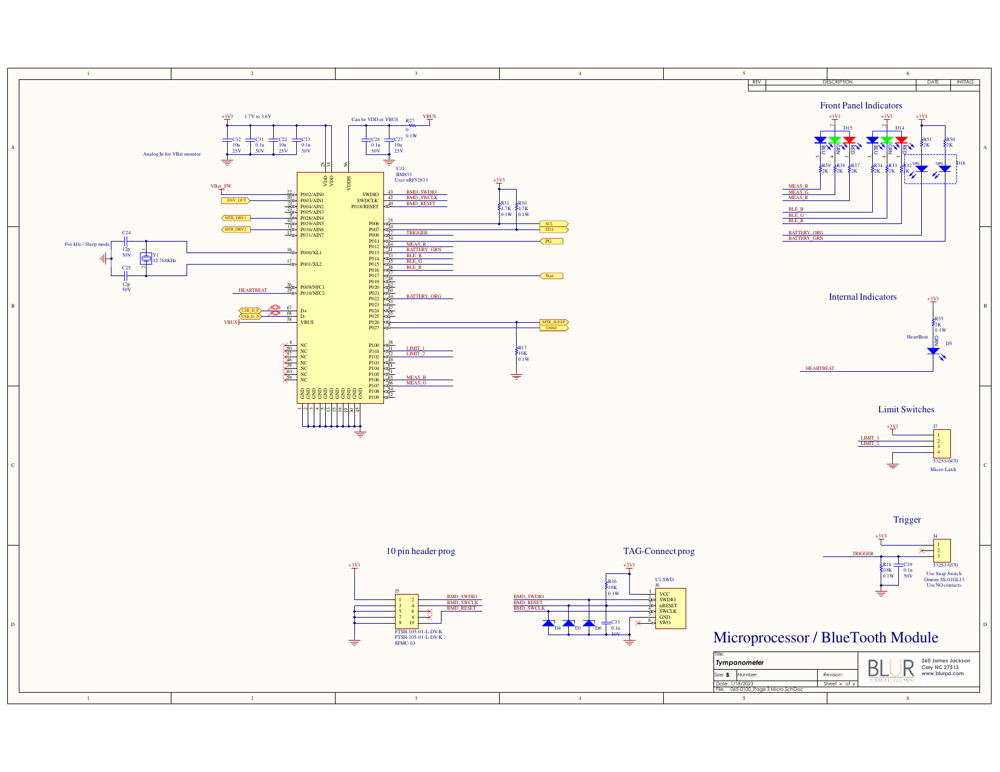
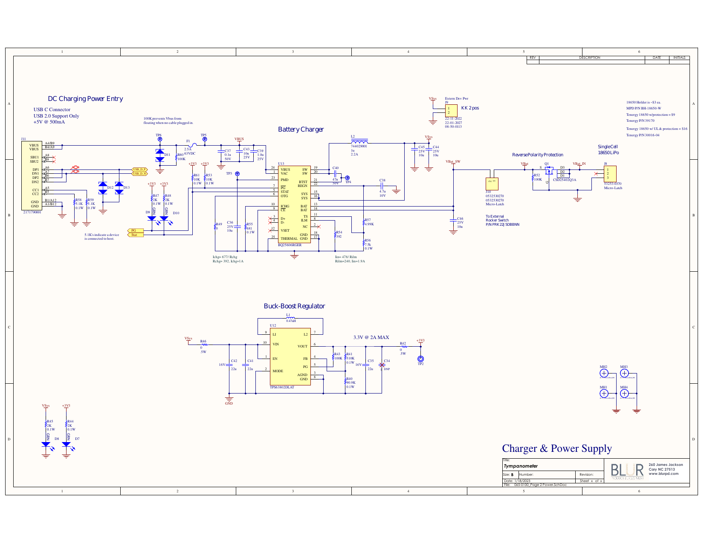
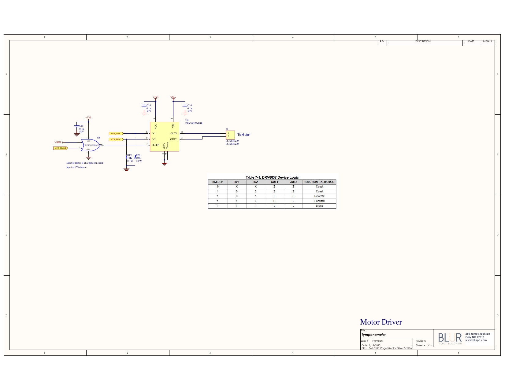

# Electronics Design Automation: Schematic Capture 

## Schematic Capture

### UI/UX

{width=600px}

### Creating a Schematic

KiCad Documentation: [Schematic Editing Operations](https://docs.kicad.org/8.0/en/eeschema/eeschema.html#schematic-editing-operations)

- Create a `New Project`, which creates a schematic file.

::: callout-warning
DO NOT CHANGE THE GRID SPACING!!
:::

- Setup `Page Settings...`, using [semantic versionin](https://semver.org/) for `Revision`.

- Configure `Schematic Setup...`, including `Project:Net Classes`.

- Place component / part (`Place Symbol`) using default library. If component doesn't exist, then you either need to:

  - [Import Parts into Libraries](https://docs.kicad.org/8.0/en/getting_started_in_kicad/getting_started_in_kicad.html#library_and_library_table_basics)

  - Download the part from an online database (e.g., [SnapEDA](https://www.snapeda.com/))

  - Create part using the `Library Editor`.

---

- Annotate components (give each component a unique label).  

::: callout-note
This is now done automatically in KiCad 8.x, but you may want to manually
override some of the annotation defaults.
:::

- Assign component values

- Label nets with meaningful names

  - Nets are like nodes; common voltage connections.

  - Use **net labels** to avoid connection chaos.

### In-Class Exercise: Part I

Let's create a simple voltage divider circuit...

### Power Ports

- Power ports, including ground references, are also global net labels.

- Component pins can be explicitly designated power in/out (in contrast to
signal).

- Power, ideally, cascades top-to-bottom (`+` $\rightarrow$ `GND`
\[$\rightarrow$ `-`\]) on the schematic.

### In-Class Exercise: Part II

Let's add power ports...

### Electrical Rules Check (ERC)

- Check the validity of the schematic

- Common error message:

> "Input Power pin not driven by any Output Power pins"

- KiCad checks to make sure that power can "drive" components that demand that input.

- You can explicitly indicate this in the schematic using the `PWR_FLAG` symbol attached to the net in question.

- Might need to re-map pin types (`Properties:Edit Symbol:Pin Table`).

---

{width=800px}

### Best Practices

- Signal, ideally, flows left-to-right (input $\rightarrow$ output).

- Outline and label functional blocks.  Use `Heirarchical Sheets` to organize
more clearly-defined sub-circuits.

- Can include non-electrical items, like `Mounting Holes`.

- Add Test Pins/Pads to nets you will want to verify during testing.

  - Power nets

  - Signal I/O

- Use `No-Connection` flags for pins that are intentionally not connected to
other components.

---

### Schematic Components Not on the PCB

If a component will not exist on the PCB (e.g., a power switch, a control knob):

- Be sure to exclude it from the board (`Properties` $\rightarrow$ `General`
$\rightarrow$ **Exclude from Board**).

- Represent the **Connectors** or **Terminal Blocks** on th schematic that will
be used to connect the component to the PCB by wires.

### In-Class Exercise:  Part III

Modify your circuit to use a 9 V battert that will be connected to the PCB using
a 2-pin connector.

### Heirarchecal Sheets

- Circuits can get very complicated very quickly; quickly separated from
functional signal flow.

- Can organize functional sub-circuits into **sheets** (similar to writing
functions in software development).

- Sheets require explicit types of "pins" to allow signals to communicate
between sheets.

- Power ports are **global** and do not need to be explicitly connects.

### Example Project Schematic

---

{width=800px}

---

{width=800px}

---

{width=800px}

---

{width=800px}

## Bill of Materials (BOM)

- All of the components in the schematic can be populated into a Bill of
Materials.

- Industry-standard ECAD packages will be automatically linked to online part
catalogs to order.

- Components excluded from the board are still included in the BOM, unless
explicitly excluded from the BOM (`Properties`).

## Troubleshooting

- Certain video cards will not work well with the PCB tool.  In that case,
disable the `Accelerated` toolset and choose the `Fallback` graphics toolset.

- On Macs, your part / footprint / model libraries might not be detected
automatically after installation.  You might need to manually point Kicad at
them in a path similar to: `Macintosh/Library/Application Support/kicad/templates/sym-lib-table/`.

## Resources

- [KiCad Documentation](https://docs.kicad.org/8.0/en/getting_started_in_kicad/getting_started_in_kicad.html)

- [Schematic Review Checklist](https://github.com/azonenberg/pcb-checklist/blob/master/schematic-checklist.md)
