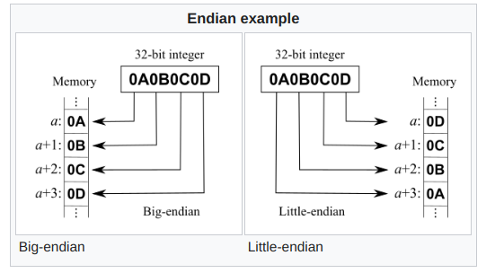
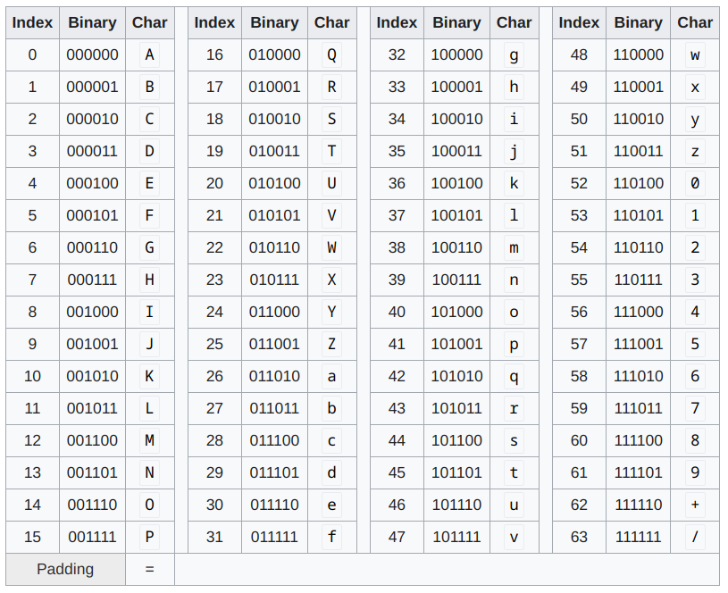
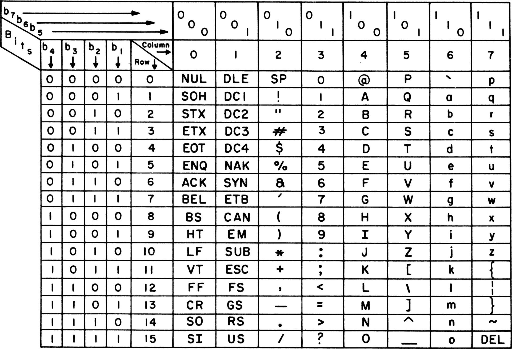
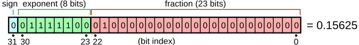
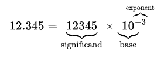

# Binary Data

## Why Base2?

- Binary states: `HIGH` and `LOW`
- `LOW` is commonly `GND`
- `HIGH` is commonly either 5, 3.3 or 1.8 V.
- Why binary?  Electronics really can only represent `On` and `Off` states at the lowest level in hardware.

## Binary (Base2) Numbers

- `base10` (decimal): 0-9 in summed powers of 10.
- `base2` (binary): 0, 1 in summed powers of 2.
- Convert binary to decimal: $a_n2^n + a_{n-1}2^{n-1}+\dots+a_12^1+a_02^0$, where $a_n$ is the $n^{th}$ bit in the binary number:
  - For example, for the binary number 0b101 (where '0b' means the number is represented in binary), the first 1 (from left to right) is in the 2nd bit spot, the 0 is in the 1st bit spot, and the second 1 is in the 0th bit spot. 
  - Using the above formula results in $1*2^2 + 0*2^1 + 1*2^0 = 4 + 0 + 1 = 5$

## Common Binary Number Word Lengths

*Word:* Number of bits to use to express a value

| Bit Depth | Name | Example |
|-----------|------|---------|
| 1 | Bit | 0 |
| 4 | Nibble | 1001 |
| 8 | Byte | 10011011 |

"Standard" word length can be system architecture dependent (16-, 32- or 64-bits)

## Endianness

The bits--or bytes--of a word can be organized from most significant to least significant or vice versa; this order is referred to as **endianness**.

{fig-align="center"}

[https://en.wikipedia.org/wiki/Endianness](https://en.wikipedia.org/wiki/Endianness)

## Data Encoding

Raw binary data (bits) can quickly become cumbersome to read and write.  To make data more human readable, we can encode it into a more compact form.

## Hexadecimal (Base16)

- `base16` (hexadecimal): 0-9, A-F in summed powers of 16 (0-15).
- A single character represents a *nibble*.
- Hex is indicated by a leading `0x` or `16` subscript: 22546 = `0x5812` = `5812`<sub>16</sub>

[https://en.wikipedia.org/wiki/Hexadecimal](https://en.wikipedia.org/wiki/Hexadecimal)

## Base64

{fig-align="center"}

[https://en.wikipedia.org/wiki/Base64](https://en.wikipedia.org/wiki/Base64)

# Text Encoding

## ASCII

{fig-align="center"}

[https://en.wikipedia.org/wiki/ASCII](https://en.wikipedia.org/wiki/ASCII)

## UTF-8

https://en.wikipedia.org/wiki/UTF-8

## Data Types (C)

| Name | Bit Depth | Value Range|
|------|-----------|------------|
| bool | 1 or 8 | true/false (1/0) |
| byte | 8 | 0-255 (unsigned) |
| char | 8 | -128-127 (signed) |
| int | 16 | -32768-32767 (signed) |
| uint | 16 | 0-65535 (unsigned) |
| long | 32 | -2147483648-2147483647 (signed) |
| float | 32 | 1.2E-38--3.4E38 (signed) |
| double | 64 | 2.3E-308-1.7E308 (signed) |

## How are floating point numbers represented?

{fig-align="center"}

{fig-align="center"}

## Declaring Variables by Data Type (C)

- Matlab, by default, declares variables when first used, and defaults all
numerical data to be `double` (64-bit floating point).  
- Python infers data type based on the value assigned to the variable.  
- In C, we must explicitly declare the data type of a variable, and the data
type cannot change over the life of the variable.

## Why not just make all numbers floats/doubles?  

The [Arduino Nano Every](https://docs.arduino.cc/hardware/nano-every/#tech-specs) 
has only has 6 kB of SRAM (static RAM).  If we can use smaller data types, we
can store more data in memory.

```C

int16_t my_int = 5; // 16-bit signed integer
uint16_t my_uint = 5; // 16-bit unsigned integer
float my_float = 5.0; // 32-bit floating point

```

## Variable Scope

Variables can be limited in their **scope** (where they are accessible).

- **Global** variables are defined outside of functions and are globally
available to everything in your program.
- **Local** variables are defined inside of functions and are only visible
within that function.

```C
#include <zephyr/kernel.h>

int my_global_variable; // global variable

void my_function(int my_input) {
  int my_local_variable; // local variable
  // do something
}

```

## Constants (`const`)

- Variables that have values that will not change can be declared as
**constants** (`const`).
- Constant variables consume a fixed amount of memory based on their data type
when they are declared and defined.

## MACROS

- **MACROS** are preprocessor directives that are replaced with their values
(constants of function definitions) before the code is compiled.
- MACROS save memory compared to using constant variables and can improve
readability.
- Defined with the `#define` directive after `#include` preprocessor directives
and are typically typed in `ALLCAPS`.
- VS Code will color highlight MACROs differently than variables.

```C
#include <zephyr/kernel.h>

#define MY_MACRO 1

void my_function(int my_input) {
  // do something
  int a = MY_MACRO * my_input;
}
```

## Static Variables

Static variables have different properties depending on whether they are local
or global.  Static variables get their own memory space that is not shared with
other variables that are more dynamically allocated.

### Global

- Globally-defined static variables are limited in scope to the `*.c` file they
are defined in.
- Protects against name collisions (linkage) across multiple source code files.

### Local

- Static variables defined in functions retain their value between function
calls (exit and re-entry).


```C
#include <zephyr/kernel.h>

void my_function(int my_input) {
  static int my_static_variable = 0; // static local variable
  my_static_variable += my_input;
  printk("The value of my_static_variable is %d\n", my_static_variable);
}
```

## Typecasting

- Use different data types in mathematical operations can lead to unexpected results.  

::: callout-warning
Watch out for integer math (fixed point) that will yield a non-integer (floating point) result.
:::

```C
void main(void) {
  int a = 5;
  int b = 3;
  float c;

  c = a / b; // c = 1.0
}
```

---

- **Typecasting** is performed by placing the desired data type in parentheses before the value or variable.
- Once a typecasted variable is encountered in the expression (by order of operations), then the rest of the operation is performed in that typecast unless typecasted again.

```C
int a = 5;
int b = 3;
float c;

c = (float)a / b; // b is typecasted to float 
                  // because a is typecasted to float
```

## Bit Depth

::: callout-warning
Watch out for the range of your data type!  If your mathematical operation
exceeds the min/max value of the bit depth, the data will "wrap around".
:::
  
```C

uint8_t a = 255; // 8-bit unsigned integer

a = a + 1; // a = 0

```

## Printing / Logging Data Types

| Formatted Print Placeholder | Data Type |
| --------------------------- | --------- |
| `%d` | decimal (int) |
| `%ld` | long decimal (32-bit) |
| `%lld` | long long decimal (64-bit) |
| `%u` | unsigned decimal (uint) |
| `%f` | float |
| `%c` | char |
| `%s` | string (char array)  |
| `%x` | hex (int) |
| `%b` | binary (int) |
| `%p` | pointer (memory address) |

```C
printk("The value of a is %d\n", a); // %d must match the data type of a to properly print its value
```

## Pointers

One of the greatest strengths--and most dangerous aspects--of C is the use of pointers.  A pointer is a variable that stores the memory address of another variable.  Pointers are used to pass variables by reference (in contrast to value) to functions, and to dynamically allocate memory.

Pointers save memory and time by not copying the value of a variable to a function.  Instead, the function can directly access the variable in memory.  This is especially useful for large data structures.

---

```C
int a = 5;

void my_function(int *a_ptr) {  // *a_ptr is a pointer to int a
  *a_ptr = 10; // dereference a_ptr to change the value of a
  // note no value is returned; it is assigned directly to the memory address
}

void main() {
  printk("The value of a is %d\n", a); // prints 5
  my_function(&a); // pass the memory address (&) of a to my_function
  printk("The value of a is %d\n", a); // prints 10
}
```

## General C Code Structure

- Organization of C code is very important!  Developers will "expect" certain things to be in certain places.
- C code is compiled (built) into a binary executable that is loaded onto the microcontroller.  It is not "run" on-the-fly as an interpreted language like Matlab or Python.

---

```C
#include <zephyr/kernel.h>  // include system libraries
#include "my_great_library.h" // include your own libraries

#define MY_MACRO 1 // define MACROs

void my_function(int32_t my_input); // function prototype

int32_t my_global_variable; // global variable

void my_function(int32_t my_input) { // function definition
  // do something
  // no return b/c of void return type
}
```

## Coding Style

- All lines of code must end with a semicolon `;`.  
- Indentation helps with readability, but does nothing to delineate code blocks.  
- Code blocks are delineated by curly braces `{}`.  

# Functions

## Return Types/Codes

- Most C functions will return a value, but that value tends to be an **exit code**, not a value being assigned to a variable.
- These codes are used to indicate the success or failure of the function, and tend to be ints.  
- Returned `0` indicates success, and any other value indicates failure.
- The return type is defined in the function prototype.  
- If the function does not return a value, the return type is `void`.

---

```C
int my_function(void) {
  // do something
  return 0; // return 0 for success
}

void main(void) {
  int return_code = my_function();
  if (return_code) {
    printk("Failure!\n");
  } else {
    printk("Success!\n");
  }
}
```

## Function Arguments

- Function arguments are defined in the function prototype.
- Most of our arguments will be passed by reference (pointers to memory addresses), not value.  This means that the function will be able to change the value of the variable passed to it by pointer reference.
- If the function does not take any arguments, the argument list is `void`.  The function may still operate on variables if they are global.

## `main`

- In Zephyr, the primary source code file is `src/main.c`.
- In Zephyr (and many other C frameworks), the `main()` function is the entry point of the program.

# Fun Data Structures

## Arrays

- Arrays are a contiguous block of memory that can store multiple values of the same data type.
- Arrays are declared with a fixed length.
- Arrays are indexed starting at `0` (not `1`!).
- Arrays can be declared with an initial value, or initialized later.
  - `int my_array[5] = {1, 2, 3, 4, 5};`
  - `int my_array[5] = {0};`
  - `int my_array[5];`
- The only time to populate all of the elements of an array is when it is initialized.  Otherwise, you can:
  - Populate each element individually (e.g., a `for` loop), or 
  - Create a new array and then copy it over the existing array using `memcpy()`.

## Enumerations (Enums)

- Enums are a way to assign a name to a value.
- Enums are declared with a fixed length.
- Enums are indexed starting at `0` (not `1`!).
- Very useful for more verbose / readable `switch/case` statements.

---

```C
enum Level {
  LOW,    // by default, 0
  MEDIUM, // 1
  HIGH    // 2
};

void main(void) {
  enum Level my_level = MEDIUM;

  switch (my_level) {
    case LOW:
      printk("Low level\n");
      break; // break out of switch statement
    case MEDIUM:
      printk("Medium level\n");
      break;
    case HIGH:
      printk("High level\n");
      break;
    default:
      printk("Unknown level\n");
      break;
  }
}
```

## Structs

- Structures group multiple variables together.
- Structures are declared with a fixed length.
- Nice data structure to organize variables that are related to each other.

```C
struct Person {
  char name[50];
  int age;
  float height;
};

void main(void) {
  struct Person my_person = {"John", 32, 1.8};

  printk("My name is %s\n", my_person.name);
  printk("I am %d years old\n", my_person.age);
  printk("I am %f meters tall\n", my_person.height);
}
```

# Flow Control

## Conditional Statements

```C
if (a == 5) {
  // do something
} else if (b != 3) {
  // do something else
} else {
  // do something else
}
```

## Loops

```C
for (int i = 0; i < 10; i++) {
  // do something
}

while (a < 10) {
  // do something
  a++;
}

while () {
  // do something
  if (a == 10) {
    break; // break out of loop
  }
}
```

## Project Libraries

- Writing your own libraries is a great way to organize your code and make it more readable.
- Libraries can also be shared with others and re-used in other projects.
- `#include "your_library.h"` can be used to include a library in your source code.
- A library contains a pair of files:
    1. `your_library.h` contains the function prototypes and macro definitions.
    1. `your_library.c` contains the function definitions.
- To make sure that a library doesn't get included multiple times, use the following syntax in your header file:

---

```C
#ifndef YOUR_LIBRARY_H
#define YOUR_LIBRARY_H

// function prototypes and macro definitions

#endif
```

- The definition of the macro `YOUR_LIBRARY_H` is tested for, and it is defined, then it has already been included into the code.
- In your library source code (`your_library.c`), you need to include this header file:

```C
#include "your_library.h"
```

## Resources

- [C Programming Language](https://www.geeksforgeeks.org/c-programming-language/)