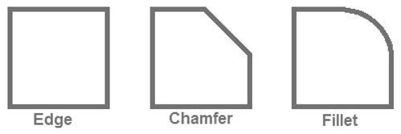
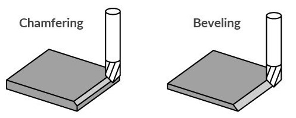
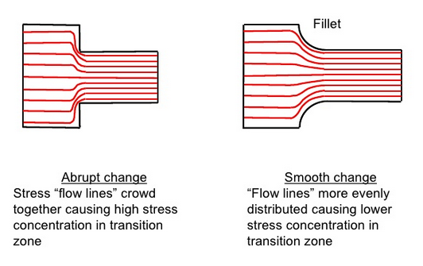
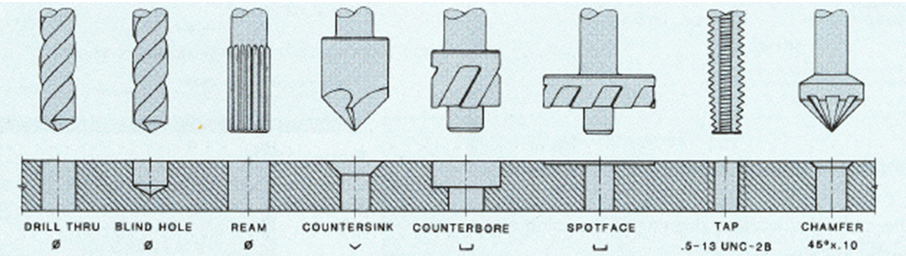

# Computer Aided Design (CAD) with Onshape

## Why CAD?

- Formally capture 2D projection sketches → 3D parts.

- Dimension consistency checks.

- Assemble multiple parts to check fit, interfaces and simulate stress/strain/movement.

- Translate to physical realization (e.g., 3D print, mil).

- General technical drawings for manufacturing.

- Capture design history, while facilitating iteration / change.

## Onshape

{width="50%"}

- We will be using Onshape, a cloud-based CAD package with a similar workflow to
SolidWorks. 

- You will receive an email notification about being added to Duke's Onshape
instance: [https://duke.onshape.com](https://duke.onshape.com)

::: callout-note
This is a specific Duke instance of Onshape, not the public one
([https://onshape.com](https://onshape.com)).  Your Duke account creation will
also automatically trigger an account being created in the non-Duke system too,
but you cannot share projects between the two instances, so please make sure
that you are using the Duke version for coursework!!
:::

### General Workflow

- **Sketch** 2D profiles (dimensioned).

  - Use **dimensions** to size parts / features.

  - Use **constraints** to align sketch features to one another (avoid over constraining!).

  - Use **contruction** lines to help with sketching.

- **Extend** 2D profiles to 3D parts.

  - Extrude (new, add, subtract, intersection)

  - Revolve

  - Utilize symmetry to mirror operations

---

- **Modify** 3D parts

  - Fillet/chamfer edges

  - Hole tool

  - Combine common modifications into single step

  - Utilize "patterns" to repeat modifications

- **Assemble** multiple parts.

- Create mechanical drawings for machining / documentation.

### Tips

- Utilize part symmetry and patterns to reduce manual effort.

- Define new sketch planes on part references that “make sense”.

- **Practice!!**

  - There are many ways to create the same parts. 

  - Some are more amenable to future modification than others; those aren’t always the fastest to create from scratch.

  - Experience is highly valuable on a resume.

## Mechanical Design Considerations

### Modifying Edges / Corners

- **Fillet** - rounded edge/corner

- **Chamfer** - sloped / angled corner / edge

{width="50%"}

{width="50%"}

### Why modify edges?

- Reduce stress concentrations (fillet > chamfer)

- Reduce sharp edges

- Ease assembly (potentially at a cost to manufacturing)

{width="50%"}

### Type of Holes

{width="100%"}

- CAD tools have Hole tools that can be very useful.

- Hole diameter (and threading) can be specified by ANSI (e.g., #10-32, 32 tpi)
or ISO (e.g., M5-0.8, mm pitch) standards

- Mechanical drawings typically consistent of a table of holes (that can be
automatically generated when using the Hole tool)

## Mechanical Drawings

- Multiview / orthographic projection

- ISO 8015: Geometrical product specifications (GPS) — Fundamentals — Concepts, principles and rules

- Dimension callouts / values should not overlap any part lines!

---

{width="55%"}  

## Design For Manufacturing (DFM) (and beyond)

- Purpose

  - Protection (e.g., water, debris, sunlight)

  - Supporting relative position

  - Mounting

- Loading

  - Shipping

  - Gravity / Momentum

  - Falls (especially corners!)

- Buttons / Dials / Sliders

---

- Interfaces

  - Cables

  - Displays

  - Buttons

- Minimize everything else to save on time and cost!

## Subtractive vs. Additive Manufacturing

- Machining (subtractive)

  - Milling

  - Turning

  - Drilling

  - Grinding

- Additive

  - 3D Printing

  - Laser Sintering

  - Stereolithography

## In-Class Demo

- Give operations meaningful names

- Use variables for dimensions that may change
