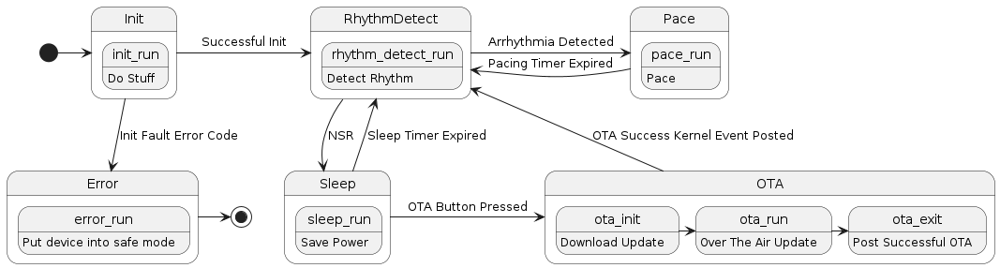
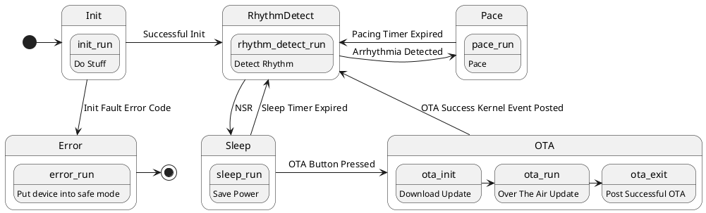

# Event-Driven State Machine

## Introduction

- Nested conditional logic main loops are hard to read and maintain.

- State machines are a common way to implement complex logic.

- States have transitions that are triggered by **events** or conditions.

  - States can have entry / exit routines that are executed when the state is entered / exited.

  - The "run" status of a state is commonly referred to as the "state machine tick" and recurrently loops.

- State diagrams are used to visualize state machines. 

- State structures are used to capture variables associated with describing the state.

## In-Class Demo

- You (and your daily routine)
  - What are your "states"?
  - What are your "events"?
- ICD

## Implementation

### State Diagram

- Generating the state diagram is the first step in implementing a state machine.

- Usually start with "pencil and paper" to sketch out the states and transitions.

- Consider the following:

  - What are the states?

  - What are the transitions?

  - What are the events that trigger transitions?

  - What are the entry / exit routines for each state?

- UML (Universal Modeling Language) is a common way to represent state diagrams.

#### PlantUML Example

## In-Class / Lab Exercise

[Event-Driven State Machine Lab Exercise (Kitchen Timer)](../lab/event-driven-state-machine-lab.md)