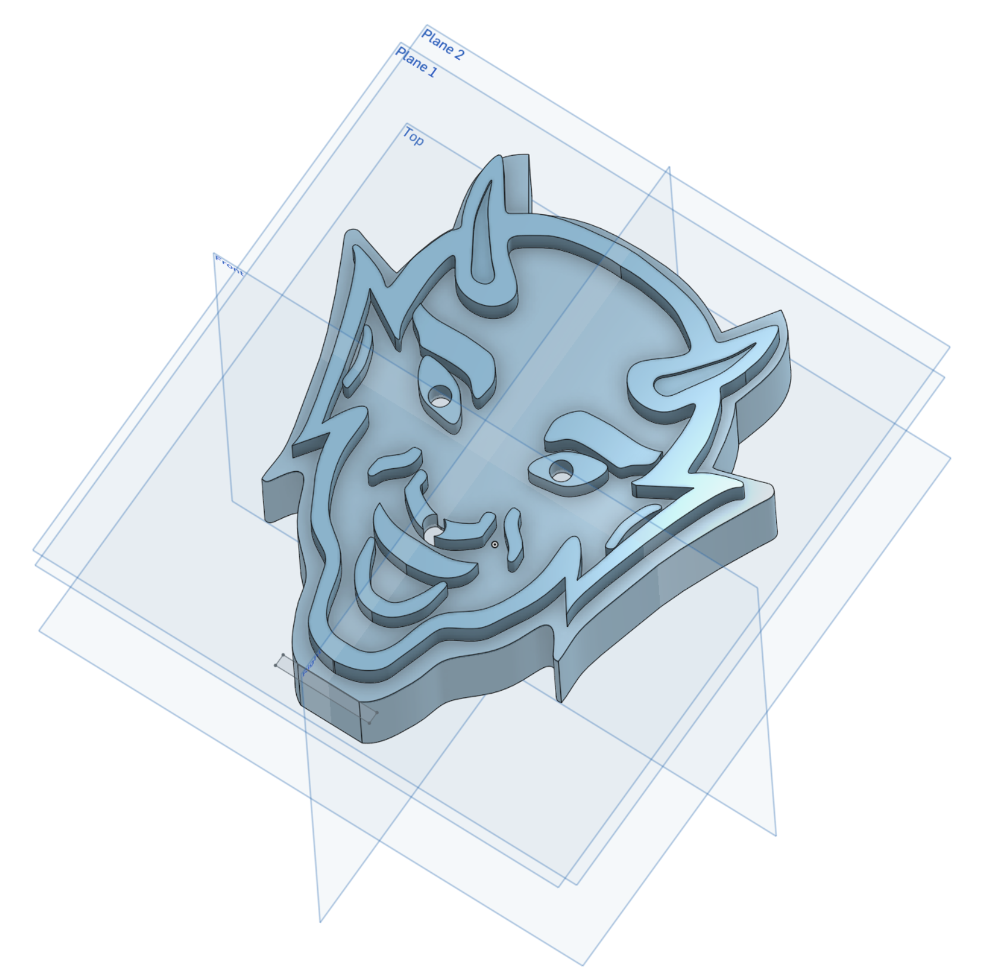
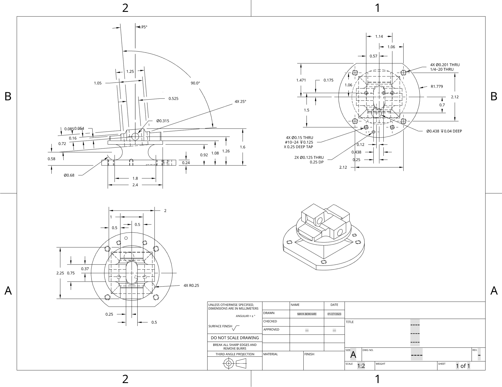
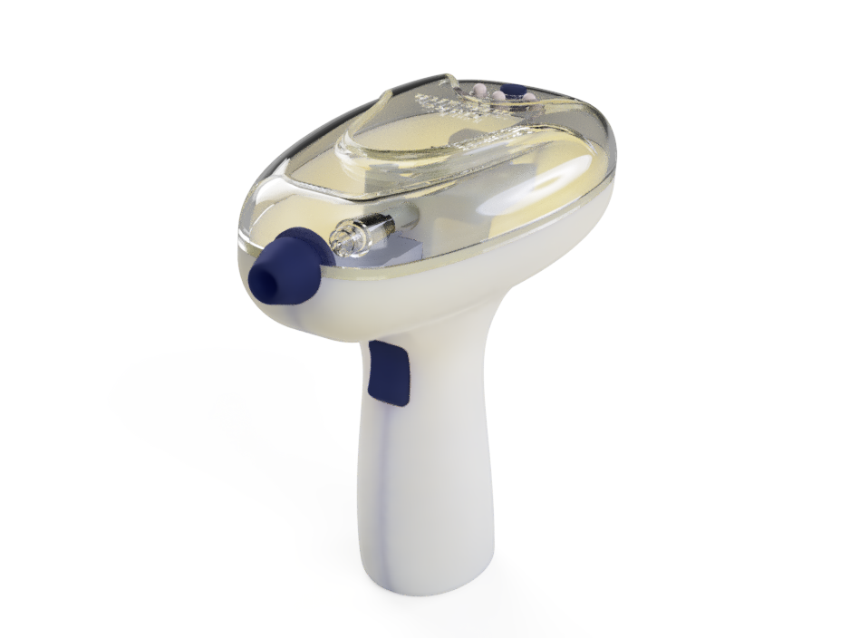
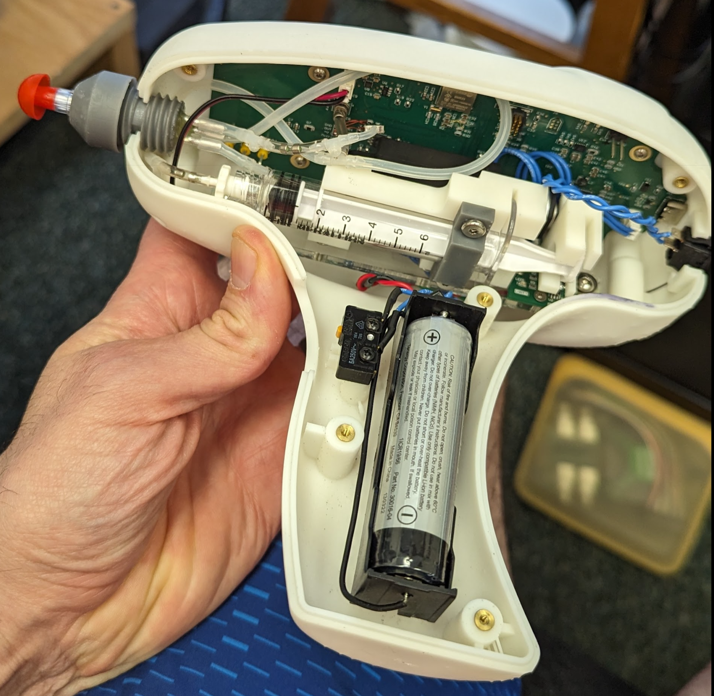
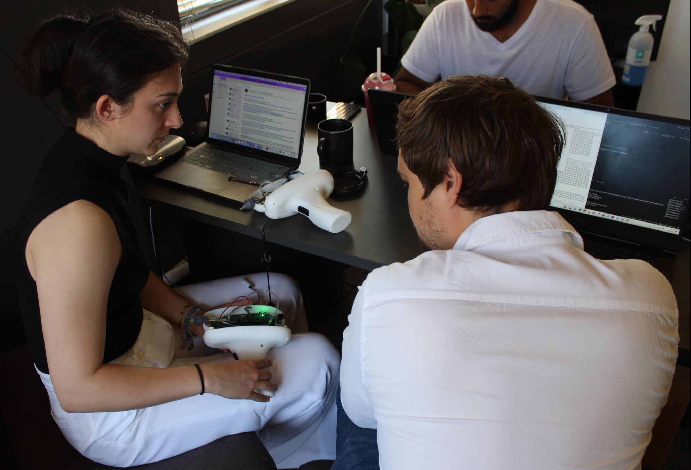
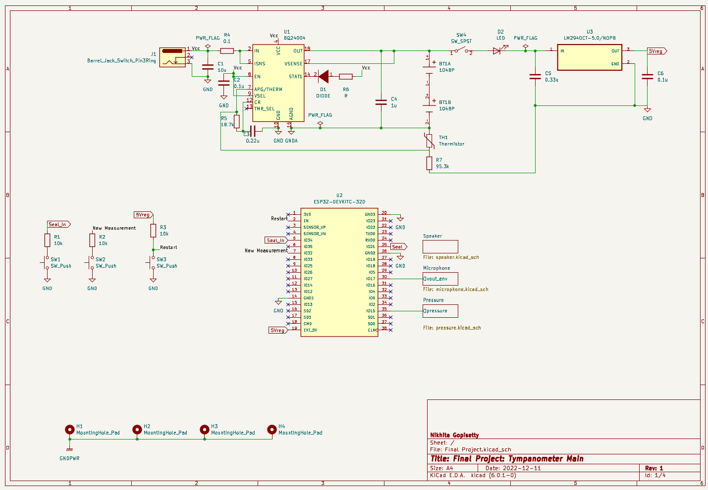
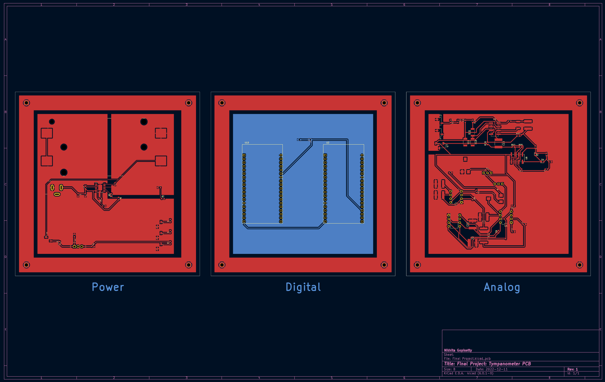
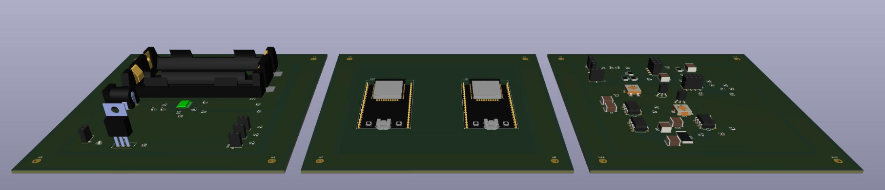
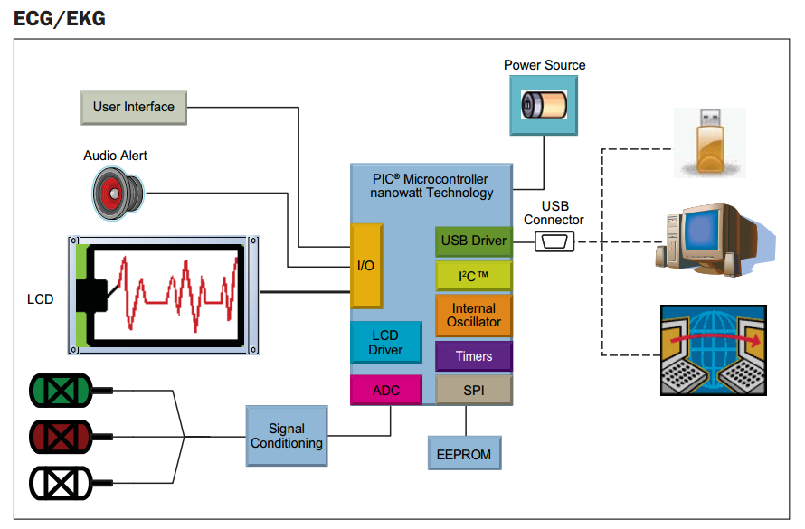
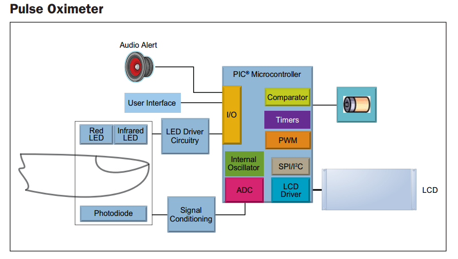

# MedTech Skills Overview

## What is MedTech?

[BME in Industry](https://sites.google.com/view/dukebmeindustryopportunities/home?authuser=0)

## Why skills?

- Do not want design ideas to be limited by what you "think" you can actually make!

- As the engineer, you bring both solution creativity and execution to the table.

- Most of the engineering curriculum has been ``book heavy'' to date.

  - Functional Decomposition

  - CAD/EDA (simulation, PCB layout)

  - Fabrication \& Integration (3D printing, soldering, fastening, mounting)

  - Verification \& Validation: testing to specifications 

  - MCU Firmware Development (C, `git`)

# CAD (Computer Aided Design)

## Why CAD?

- Formally capture 2D projection sketches $\rightarrow$ 3D parts.

- Dimension consistency checks.

- Assemble multiple parts to check fit, interfaces and simulate stress/strain/movement.

- Translate to physical realization (e.g., 3D print, mil).

- General technical drawings for manufacturing.

- Capture design history, while facilitating iteration / change.

## Onshape

{width="40%"}

- We will be using Onshape, a cloud-based CAD package with a similar workflow to SolidWorks.

- You will be automatically registered to join [Duke's Onshape team](https://duke.onshape.com).

- Tutorials are available through [https://learn.onshape.com](https://learn.onshape.com).

## Part Design

{width="50%"}

## Mechanical Drawings

{width="70%"}

## Design Example: mHealth Tympanometer

{width="70%"}

---

{width="60%"}

---

{width="70%"}

# EDA: Electronics Design Automation

## Why EDA?

- Formalize circuit schematics.

- Validate circuit behavior (design rules and SPICE simulations).

- Convert circuit to printed circuit board (more space efficient and permanent than a breadboard).

- Capture design history and facilitate rapid iteration.

- Generate 3D "parts" to integrate with CAD.

## KiCad

{width="20%"}

- [https://kicad.org](https://kicad.org)

- A completely open-source alternative to Eagle.

- Just as capable as Altium Designer (to a point); similar workflow.

- Integrated SPICE simulator.

## Schematic Capture

{width="70%"}

## PCB Layout

{width="70%"}

## PCB 3D Model

{width="100%"}

# Version Control Software

## Why Version Control?

- Preserve software (project) development history

- Collaboration

- Continuous Integration / Deployment

- Testing

- Maintaining multiple released versions

- Required for IEC 62304 (Medical Software), FDA V&V (510k clearance)

## Git

{width="100%"}

- [https://git-scm.com](https://git-scm.com)
- [https://gitlab.oit.duke.edu](https://gitlab.oit.duke.edu)
- [https://www.gitkraken.com/gitlens](https://www.gitkraken.com/gitlens)

# Firmware Development

## Why Firmware?

- While many things can be done in discrete electronics, microcontrollers and
microprocessors (and SoCs) are becoming inexpensive and ubiquitous.

- "Knowing Arduino" is not an eye-catching skill on a resume; but firmware
development is!

## Firmware isn't "software"...

- Firmware is a special kind of software that is designed to interact with hardware.

- Firmware is often written in C, but can be written in other languages.

- Firmware is highly resource constrained

- Software is often written in Python, Java, C++, etc.

- Software is often written to be run on a general-purpose computer (laptop,
desktop, server, etc.), that typically is not resource constrained.

  - User Interface

  - Web Server

  - Database

  - Data Processing / Analytics

# Medical Devices

{width="70%"}

---

{width="70%"}

## Arduino-Framework / PlatformIO

- We will use [PlatformIO](https://platformio.org) to develop firmware for our
projects using [Visual Studio Code](https://code.visualstudiocode.com) as our
IDE.

- We will use the Arduino framework (in contrast to something like Zephyr RTOS)
to develop firmware for our projects.

- Learn robust, modular firmware development practices.
